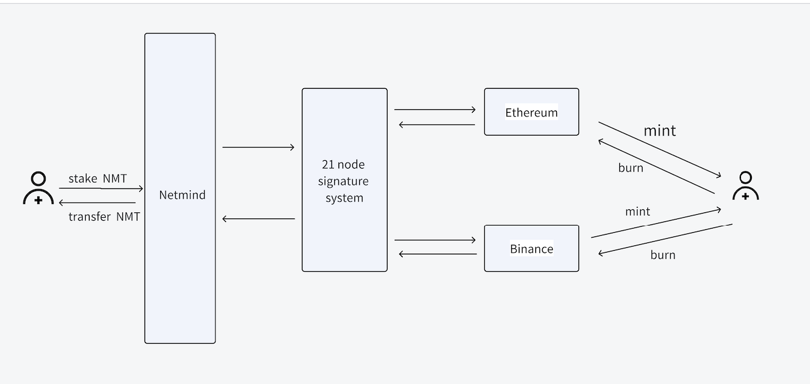

# Netmind Contract Description

## *1. Business Modules*
### 1. Conf: Configuration Contract
**Functionality**: Provides basic configuration for the Netmind system contracts and crucial configurations for external services.

**Contract Interfaces**:
1. *getAwradMSG()*: Retrieves reward parameters, returning various parameters preset by the reward service.
2. *acts()*: Retrieves a list of signatures, returning an array of signature addresses. This signature set is used for signature verification in contracts such as ledger, snapshot, accountManage, and rewardPool.

### 2. AccountManage: Account Management Contract
**Functionality**: Manages user wallet address binding and NMT recharge for fee management contracts related to training tasks.

**Contract Interfaces**:
1. *queryUserMsgById(string memory _userId)*: Queries user information by user ID, including user balance, frozen amount, and bound wallet address.
2. *queryUserMsgByAddr(address _addr)*: Queries user information by user address, including user balance, frozen amount, and user ID.
3. *initUserId(string memory _userId, address _addr)*: Initializes the mapping between user ID and wallet address for subsequent deduction and recharge services.
4. *tokenCharge()*: Allows users to recharge NMT tokens to their accounts for use in other services.
5. *withdraw(uint256 value)*: Allows users to withdraw unused NMT that has been recharged.
6. *withdrawComputingFee(address addr, uint256[2] calldata uints, uint8[] calldata vs, bytes32[] calldata rssMetadata)*: Withdraws NMT paid by users to settle fees for computing power providers. Multiple node confirmations and signatures are required for withdrawal.

### 3. Payment: Payment Contract
**Functionality**: Enables users to pay GPU leasing fees and process order refunds.

**Contract Interfaces**:
1. *payment(string memory paymentId, uint256 amt, uint256 worth)*: Pays for an order. *paymentId* is generated by the application service, *amt* represents the amount of NMT paid, *worth* indicates the value of the order, equivalent to the amount of USDC.
2. *refund(string memory paymentId, uint256 amt, uint256 expir, uint8[] calldata vs, bytes32[] calldata rs)*: Initiates a refund. *amt* is the amount to be refunded, *expir* indicates the validity period of the signature.

### 4. TrainingTask: Training Task Contract
**Functionality**: Allows users to initiate new training tasks and deduct fees from the account contract.

**Contract Interfaces**:
1. *queryJobMsg(string memory jobId)*: Queries frozen fees, usage fees, refund fees, task status, and task type for a specific task ID.
2. *execJob(string memory userId, string memory jobId, uint256 freezeAmount, uint256 jobType)*: Initiates a new training task for a user based on their requirements.
3. *updateJob(string memory userId, string memory jobId, uint256 freezeAmount, string memory orderId)*: Updates the status and usage fees of a user's training task.
4. *execJobDebit(string memory userId, string memory jobId, uint256 usageAmount, string memory orderId)*: Deducts fees for training tasks.
5. *endJob(string memory userId, string memory jobId, uint256 usageAmount, uint256 state)*: Closes the current training task upon completion and settles fees.

## *2. Economic Modules*
### 1. NetmindToken: Economic Token
**Functionality**: Facilitates cross-chain NMT token transactions on the Binance Smart Chain and Ethereum, allowing users to trade NMT.

**Contract Interfaces**:
1. *transfer(address to, uint256 amount)*: Token transfer method for user token transfers.
2. *approve(address spender, uint256 amount)*: Token authorization method.
3. *balanceOf(address owner)*: Token balance inquiry.
4. *totalSupply()*: Total supply of tokens on the specified chain.

### 2. CrossChain: Cross-Chain Contract

**Functionality**: Facilitates NMT token transfer between the Netmind chain and the Binance Smart Chain or Ethereum, enabling users to trade on the Binance Smart Chain or Ethereum and perform services on the Netmind chain.

**Contract Interfaces**:
1. *chargeRate(string calldata _chain, address _token)*: Queries the cross-chain transaction fee.
2. *stakeToken(string memory _chain, string memory receiveAddr, address tokenAddr, uint256 _amount)*: Initiates a token cross-chain operation for users.
3. *bridgeToken(address[2] calldata addrs, uint256[2] calldata uints, string[] calldata strs, uint8[] calldata vs, bytes32[] calldata rssMetadata)*: Confirms user cross-chain operations through 21 nodes, signs transaction data, and performs token transfers for users.

### 3. Pledge: Pledge Contract
**Functionality**: Allows users to pledge NMT and earn rewards.

**Contract Interfaces**:
1. *queryNodeRank(uint256 start, uint256 end)*: Queries node pledge ranking data. Only nodes ranked in the top 21 in terms of pledge amount participate in system services, such as calculating user rewards and providing reward extraction signatures.
2. *stake(address _nodeAddr, address _token, uint256 _amount)*: Allows users to pledge NMT tokens and receive pledge rewards.
3. *cancelStake(uint256[] calldata _indexs)*: Allows users to withdraw pledged NMT for other operations, such as cross-chain transactions or purchasing training services.

### 4. FixedLock: Fixed Pledge Contract
**Functionality**: Used for early VC reward locking.

**Contract Interfaces**:
1. *lock(uint256 amt) public payable notContract returns(uint256 id)*: Locks NMT tokens with a specified amount and returns the lock ID.
2. *unlock(uint256 id, uint256 amt)*: Unlocks NMT tokens.

## *3. Reward Modules*
### 1. RewardContract: Reward Contract
**Functionality**: Facilitates reward extraction.

**Contract Interfaces**:
1. *withdrawToken(address[2] calldata addrs,uint256[2] calldata uints, uint8[] calldata vs, bytes32[] calldata rssMetadata)*: Allows users to apply for reward extraction on the web page and request sufficient signatures from signing servers.

### 2. RewardPool: Reward Pool Contract
**Functionality**: Stores all preset reward tokens for the system. The contract periodically delivers generated rewards to the reward contract.

**Contract Interfaces**:
1. *move(uint256 nonce, uint256 amt,uint256 expir, uint8[] calldata vs, bytes32[] calldata rs)*: Delivers rewards to the reward contract. *nonce* is a counter in the contract, *amt* is the amount of NMT delivered to the reward contract. This method requires signature permission from the signing service to be called.
---

## *4. Fund Modules*
#### 1. CommunityFund: Community Fund
**Functionality**: Serves as a fund for Netmind community development, with unlocking periods based on time.
**Total Quantity**: 16.5 million NMT

**Unlock Schedule**:
- Months 0 to 6: Locked
- Months 6 to 24: 4.5 million NMT released over 1.5 years
- Months 24 to 48: 4 million NMT released over 2 years
- Months 48 to 72: 3.5 million NMT released over 2 years
- Months 72 to 96: 2.5 million NMT released over 2 years
- Months 96 to 120: 2 million NMT released over 2 years

**Contract Interfaces**:
1. *queryUnlock()*: Queries the currently unlocked amount of the community fund.
2. *queryProposalMsg(bool _type, uint256 _page, uint256 _limit)*: Queries the details of fund withdrawal proposals.
3. *propose(address targetAddr, uint256 amount, string memory content)*: Initiates a proposal for fund withdrawal.
4. *vote(uint256 _proposalId)*: Administrators vote to verify and ensure the proper and regulated use of community funds.
---

#### 2. TechnologyFund: Technology Fund
**Functionality**: Serves as a fund for Netmind technology development, with unlocking periods based on time.
**Total Quantity**: 10 million NMT

**Unlock Schedule**:
- Months 0 to 6: Locked
- Months 6 to 60: 6 million NMT released over 4.5 years
- Months 60 to 120: 4 million NMT released over 5 years

**Contract Interfaces**:
1. *queryUnlock()*: Queries the currently unlocked amount of the technology fund.
2. *queryProposalMsg(bool _type, uint256 _page, uint256 _limit)*: Queries the details of fund withdrawal proposals.
3. *propose(address targetAddr, uint256 amount, string memory content)*: Initiates a proposal for fund withdrawal.
4. *vote(uint256 _proposalId)*: Administrators vote to verify and ensure the proper and regulated use of technology funds.
---

## *5. Consensus Modules*
#### 1. Snapshoot: Snapshot Contract
**Functionality**: Three node servers store all user data on IPFS daily and submit the data hash to the contract. Consensus is achieved if at least two nodes submit matching data.

**Contract Interfaces**:
1. *currentDay()*: Queries the current submission day.
2. *queryVotes(uint256 _type, uint256 _day)*: Queries submitted data for historical restoration.
3. *queryCurrentVotes(uint256 _type)*: Queries the consensus status of the current day's data submission. If consensus is not reached, all nodes will re-verify and resubmit data.
4. *updateSnapshoot(uint256[] calldata _types, uint256[] calldata _days, string[] calldata _dataHashs, string[] calldata _dataIds)*: All nodes submit user data daily. Consensus is reached if more than half of the nodes submit matching data.
---

#### 2. Ledger: Ledger Contract
**Functionality**: Synchronizes user reward extraction data to the contract for subsequent historical data recovery by nodes.

**Contract Interfaces**:
1. *queryVotes(address userAddr, uint256 nonce)*: Queries historical data on user reward extraction for data recovery.
2. *updateLedger(address[] calldata _userAddrs, uint256[] calldata _nonces, address[] calldata _tokenAddrs, uint256[] calldata _amounts, string[] calldata _txHashs)*: Nodes synchronize user reward extraction amounts to the contract for consensus judgment. Consensus is reached if more than half of the nodes submit matching data. If consensus fails, all nodes will resubmit data.
---

## *6. Governance Modules*
#### 1. ManageMent: Governance Contract
**Functionality**: Manages all contract permissions to prevent single address control, mitigating risks of private key leakage and permission loss. Currently managed by 8 nodes, requiring votes from at least 5 nodes for any operation.

**Contract Interfaces**:
1. *queryVotes(uint256 _proposalId)*: Queries the voting status of proposals to operate contracts.
2. *updateProxyAdminPropose(address _targetAddr, address _addr)*: Proposes changes to contract admin permissions.
3. *updateProxyUpgradPropose(address _targetAddr, address _addr)*: Proposes contract upgrades.
4. *excContractPropose(address _targetAddr, bytes memory _data)*: Proposes execution of contract operations.
5. *votes(uint256 _proposalId)*: Votes on proposal IDs.
---